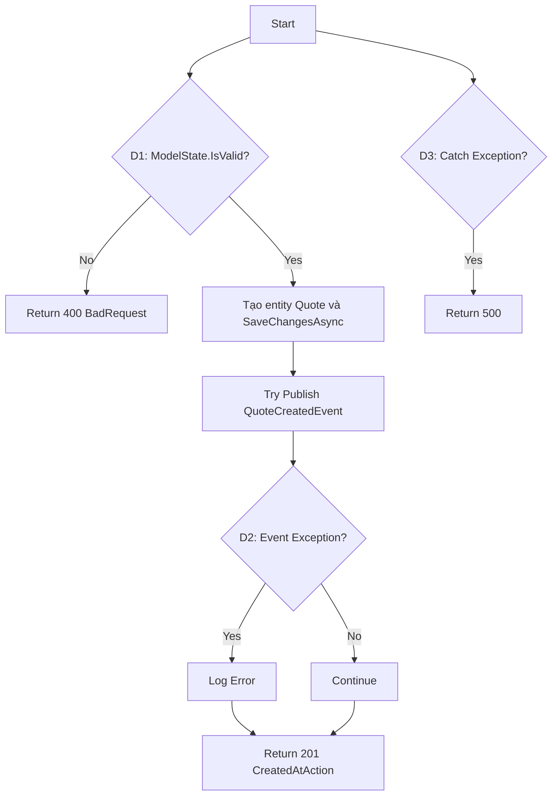
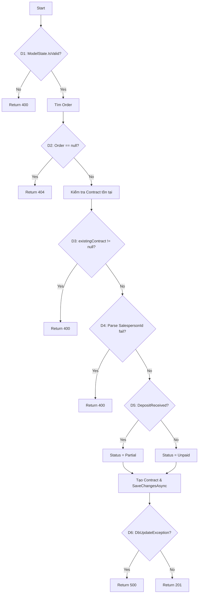
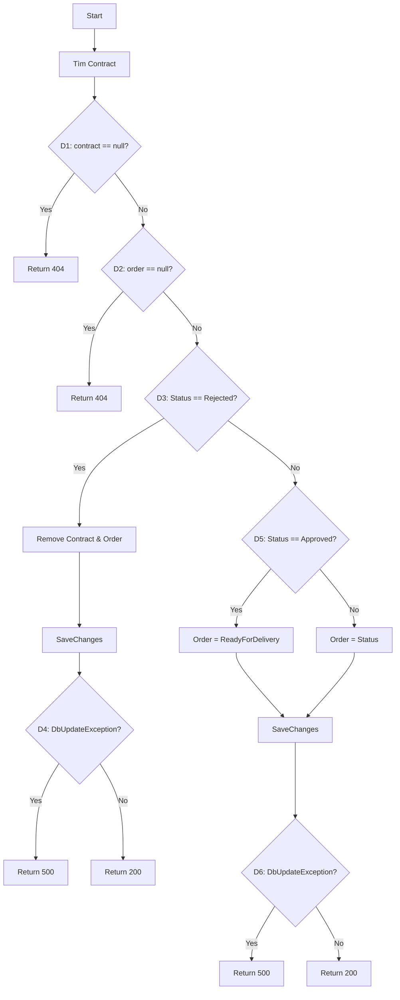
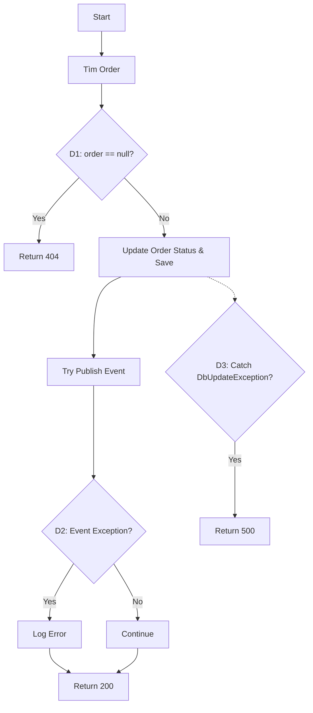

# Chuẩn Bị Kiểm Thử Hộp Trắng — Module C

> **Dự án**: EV Dealer Management System  
> **Ngày tạo**: 2026-07-03 | **Phiên bản**: 2.0 (Thực tế Source Code)  
> **Mục đích**: Phân tích CFG, Cyclomatic Complexity, và thiết kế white-box test cases dựa trên code thật.

---

## Danh Sách 5 Functions Thực Tế Được Chọn

| # | Method | Controller | File | Lines | Complexity V(G) |
|---|---|---|---|---|---|
| 1 | `CreateQuote` | QuotesController | `SalesService/Controllers/QuotesController.cs` | 105-170 | 4 |
| 2 | `CreateContract` | ContractsController | `SalesService/Controllers/ContractsController.cs` | 48-110 | 7 |
| 3 | `UpdateContractStatus` | ContractsController | `SalesService/Controllers/ContractsController.cs` | 132-198 | 7 |
| 4 | `CompleteOrder` | OrdersController | `SalesService/Controllers/OrdersController.cs` | 37-229 | 12 |
| 5 | `UpdateOrderStatus` | OrdersController | `SalesService/Controllers/OrdersController.cs` | 286-335 | 4 |

---

## 1. QuotesController.CreateQuote

### 1.1 Thông tin
- **Signature**: `public async Task<ActionResult<Quote>> CreateQuote([FromBody] CreateQuoteDto createQuoteDto)`
- **Logic chính**: Validate ModelState -> Gán DTO sang entity -> SaveChanges -> Publish Event (Catch và log nếu lỗi RabbitMQ) -> Trả về 201. Nếu Exception hệ thống -> Trả về 500.

### 1.2 Decision Points
| D# | Decision | True Branch | False Branch |
|---|---|---|---|
| D1 | `!ModelState.IsValid` | return 400 | continue |
| D2 | Event Exception | Log error, continue | continue |
| D3 | Catch Exception | return 500 | return 201 |

### 1.3 Control Flow Graph (Mermaid)

- **V(G)** = 3 + 1 = 4. Cần 4 paths để cover nhánh.

---

## 2. ContractsController.CreateContract

### 2.1 Thông tin
- **Signature**: `public async Task<IActionResult> CreateContract([FromBody] CreateContractRequest request)`
- **Logic chính**: Tìm Order -> Kiểm tra đã có Contract chưa -> Parse SalespersonId -> Sinh ContractNumber -> Gán Status="PendingApproval" -> Save.

### 2.2 Decision Points
| D# | Decision | True Branch | False Branch |
|---|---|---|---|
| D1 | `!ModelState.IsValid` | return 400 | continue |
| D2 | `order == null` | return 404 | continue |
| D3 | `existingContract != null` | return 400 | continue |
| D4 | `!int.TryParse(request.SalespersonId)` | return 400 | continue |
| D5 | `request.DepositAmountReceived` | "Partial" | "Unpaid" |
| D6 | `DbUpdateException` | return 500 | return 201 |

### 2.3 Control Flow Graph (Mermaid)

- **V(G)** = 6 + 1 = 7.

---

## 3. ContractsController.UpdateContractStatus

### 3.1 Thông tin
- **Signature**: `public async Task<IActionResult> UpdateContractStatus(int id, [FromBody] UpdateStatusRequest request)`
- **Logic chính**: Nếu status "Rejected", xoá hợp đồng và xoá Order. Nếu "Approved", chuyển Order sang "ReadyForDelivery". Các status khác chuyển Order theo Status.

### 3.2 Decision Points
| D# | Decision | True Branch | False Branch |
|---|---|---|---|
| D1 | `contract == null` | return 404 | continue |
| D2 | `order == null` | return 404 | continue |
| D3 | `request.Status == "Rejected"` | Remove Contract & Order | Set Status |
| D4 | `DbUpdateException` (Rejected) | return 500 | return 200 |
| D5 | `request.Status == "Approved"` | Order Status = ReadyForDelivery | Order Status = request.Status |
| D6 | `DbUpdateException` (Update) | return 500 | return 200 |

### 3.3 Control Flow Graph (Mermaid)

- **V(G)** = 6 + 1 = 7.

---

## 4. OrdersController.CompleteOrder

### 4.1 Thông tin
- **Signature**: `public async Task<IActionResult> CompleteOrder([FromBody] CreateOrderRequest request)`
- **Logic chính**: Order Creation hạng nặng. Mapping rất nhiều property, tính Discount, xác minh TotalPrice, kiểm tra/cập nhật Quote, Save changes, gửi sự kiện RabbitMQ.

### 4.2 Decision Points
| D# | Decision | True Branch | False Branch |
|---|---|---|---|
| D1 | `string.IsNullOrWhiteSpace(CustomerEmail)` | return 400 | continue |
| D2 | `string.IsNullOrWhiteSpace(CustomerName)` | return 400 | continue |
| D3 | `request.QuoteId > 0` | Check Quote | Tạo Order luôn |
| D4 | `quote != null` | Check Quote Status | Cảnh báo log, tiếp tục |
| D5 | `quote.Status == "Active"` | Update Quote Status | Cảnh báo log |
| D6 | `order.DiscountAmount.HasValue` | Tính theo Amount | Kiểm tra Percent |
| D7 | `order.DiscountPercent.HasValue` | Tính theo Percent | TotalDiscount = 0 |
| D8 | `order.TotalPrice < 0` | Set TotalPrice = 0 | Giữ TotalPrice |
| D9 | `order.TotalPrice <= 0` | return 400 | continue |
| D10| Catch Exception Event | Log error | continue |
| D11| Catch Global Exception | return 500 | return 200 |

### 4.3 Cyclomatic Complexity
- **V(G)** = 11 + 1 = 12. Đây là core business function quan trọng nhất.

---

## 5. OrdersController.UpdateOrderStatus

### 5.1 Thông tin
- **Signature**: `public async Task<IActionResult> UpdateOrderStatus(int id, [FromBody] UpdateStatusRequest request)`
- **Logic chính**: Cập nhật trạng thái đơn hàng. Có bắn sự kiện.

### 5.2 Decision Points
| D# | Decision | True Branch | False Branch |
|---|---|---|---|
| D1 | `order == null` | return 404 | continue |
| D2 | Catch Event Exception | Log error | continue |
| D3 | Catch DbUpdateException | return 500 | return 200 |

### 5.3 Control Flow Graph (Mermaid)

- **V(G)** = 3 + 1 = 4.

---

## Tổng Kết Coverage Target

| Coverage Type | Target | Status |
|---|---|---|
| Statement Coverage | 100% | Cần test cases phủ hết các đường đi code thực tế |
| Branch Coverage | 100% | Cần mock DbContext / Repository để giả lập lỗi DB |
| Unit Test Count | Min 15 | Thực thi bằng xUnit và Moq |
